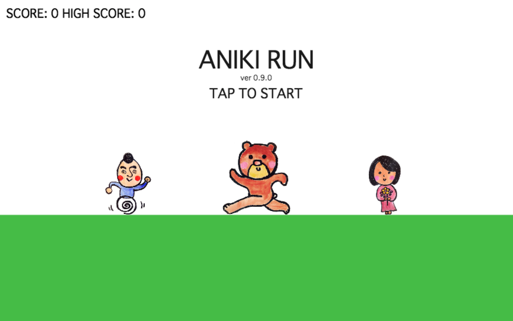

# ANIKIRUN

アニキが主人公の、福井県池田町で遊べるジャンプゲームです。

## デモ

http://codeforfukui.github.io/ANIKIRUN/

## 機能

- タップでアニキをジャンプさせる
- 障害物（クマ）を避けて目標に到達する
- スコアとハイスコアが表示される

## 使い方

1.  デモページをWebブラウザで開く
2.  画面をタップしてゲームを開始し、アニキをジャンプさせる
3.  障害物を避けて目標に到達すると次のステージに進める
4.  アニキが障害物に当たるとゲームオーバー

## データ・API

このプロジェクトは外部のデータやAPIを使用していません。

## ライセンス

このプロジェクトは [Creative Commons Attribution (CC BY) ライセンス](http://codeforfukui.github.io/ANIKIRUN/) の下で提供されています。

-   **アプリケーション:** CC BY [fukuno.jig.jp](http://fukuno.jig.jp/1686)
-   **イラストレーション:** CC BY [おしえて！いけだのアニキ](https://oshieteaniki.github.io/oshiete_ikeda_aniki.github.io/)